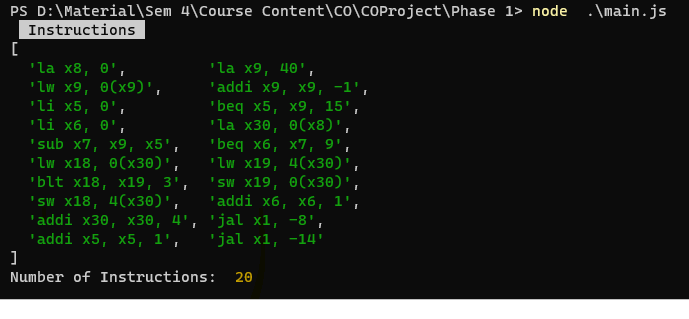

# **RISC V SIMULATOR**

## DETAILS
#### **Team:** *Dragonfly*
#### **Authors:** *Siddhartha G(CS20B040) and Preethi Varsha M(CS20B030)*
#### **Title:** *Phase 1 Report*

## SPECIFICATIONS
* [x] The simulator should support atleast 4kB of memory. *(4 kb of memory is supported)*
* [x] The simulator should read in an assembly file, execute the instructions.  
* [x] Display the contents of the registers, and the memory in the end.
* [x] Run Bubble Sort written in RISC V instructions.
* [x] Any programming language can be used. *(programming language used : javascript)*
* [x] Simulator should support the following RISC-V instructions: ADD/SUB, BNE, JAL(jump),LW/SW
---

## USAGE INSTRUCTIONS/ GUIDE
(Make sure nodejs is installed in the System)
1. In the terminal adjust the directory and run,  

    ```bash
    node main.js
    ```
    The output is now displayed in the console.
2. 10 integers which are to be sorted are already stored in contiguous memory locations whose base address is contained in *array*.
   ```ASM
   .data 
    gap: .space 0
    array:  .word -64, 64, 0, 0, 1, 2, 6, 5, 4, 4
    size: .word 10
    ```

## OUTPUT

---  

---
 

## FEATURES:
1. Commenting can be done in the assembly file using '#' before the start of the comment
2. No compulsion for indentation or a specific amount of spacing.
3. **Instructions supported:**  

    Instruction             | Meaning    |
    :---------------------- |:---------- |
    `add rd, rs1, rs1`      |addition: rd=rs1+rs2  |
    `sub rd, rs1, rs1`      |subtraction: rd=rs1-rs2  |
    `lw rd, symbol`         |Load word|
    `sw rd, offset(rs)`     |store word|
    `jal offset`             |jump and link|
    `bne  rs, rt, offset`        |branch not equal|
    `blt  rs, rt, offset`        |branch less than|
    `beq  rs, rt, offset`        |branch equal|
    `bge rs, rt, offset`        |branch greater than equal to|
    `addi rd, immediate`       |add immediate|
    `li rd, immediate`      |load immediate: rd=immediate|
    `la rd, symbol`         |Load address|
    
4. **Directives supported:**
    
    Directive      | Arguments                      | Description
    :-----------   | :-------------                 | :---------------
    `.text`        |                                | 
    `.data`        |                                | used to indicate allocation of predefined memory to certain data
    `.word`        | expression [, expression]*     | 32-bit comma separated words
    
