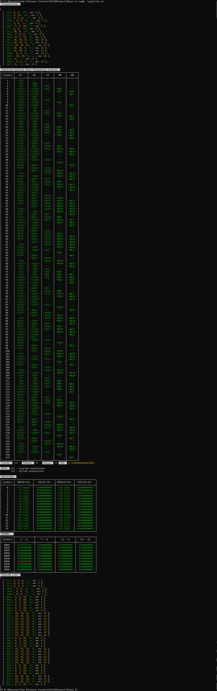

# **RISC V SIMULATOR** 
## DETAILS:
#### **Team:** *DragonFly*
#### **Authors:** *Siddhartha G(CS20B040) and Preethi Varsha M(CS20B030)*
#### **Title:** *Phase 2 Report*

## What has been done.
* [x] The simulator should support atleast 4kB of memory. *(4 kb of memory is supported)*
* [x] The simulator should read in an assembly file, execute the instructions.  
* [x] Display the contents of the registers, and the memory in the end.
* [x] Run Bubble Sort written in RISC V instructions.
* [x] Any programming language can be used. *(programming language used : javascript)*
* [x] Simulator should parse minimum # of instructions to run Bubble Sort.
* [x] Implement pipeline (with and without dataforwarding) 
* [x] Display the # of cycles, stalls and kills.
* [x] Display the IPC(Instruction Per Cycle).
* [x] Display the list of instructions for which stalls have occured.   
---

## USAGE INSTRUCTIONS/ GUIDE
(Make sure nodejs is installed in the System)
1. In the terminal adjust the directory.  
    To execute without data forwarding, run:
    ```bash
    node pipeline.js
    ```
    To execute with data forwarding, run:
    ```bash
    node pipeline_wf.js
    ```
    The output is now displayed in the console.
2. 4 integers which are to be sorted are already stored in contiguous memory locations whose base address is contained in *array* whose *size* is 4.
   ```ASM
   .data 
    gap: .space 0
    array:  .word -64, 64, 0, 0
    size: .word 4
    ```

## OUTPUT

---

---
